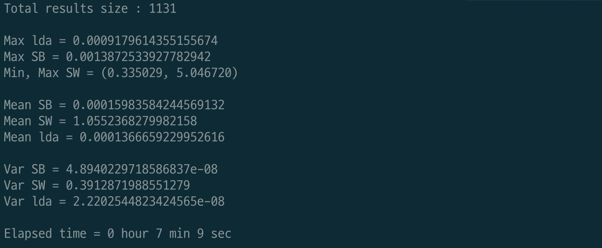
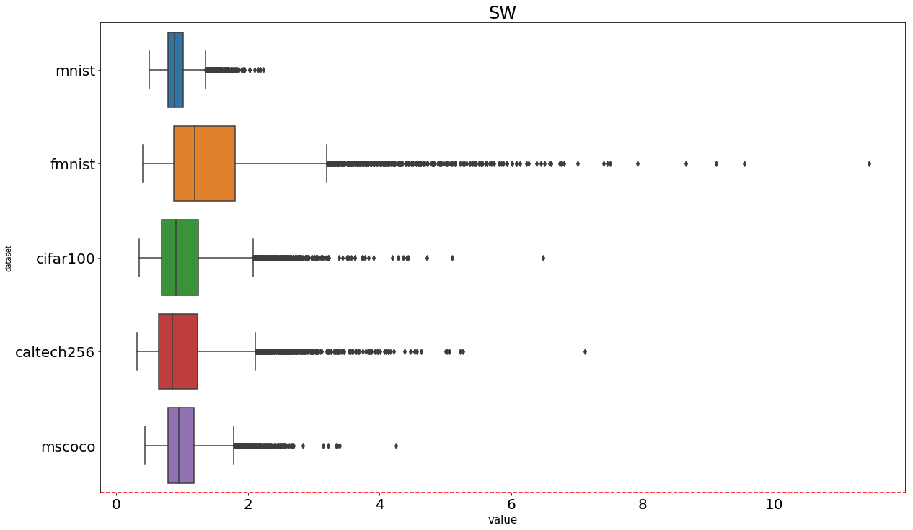
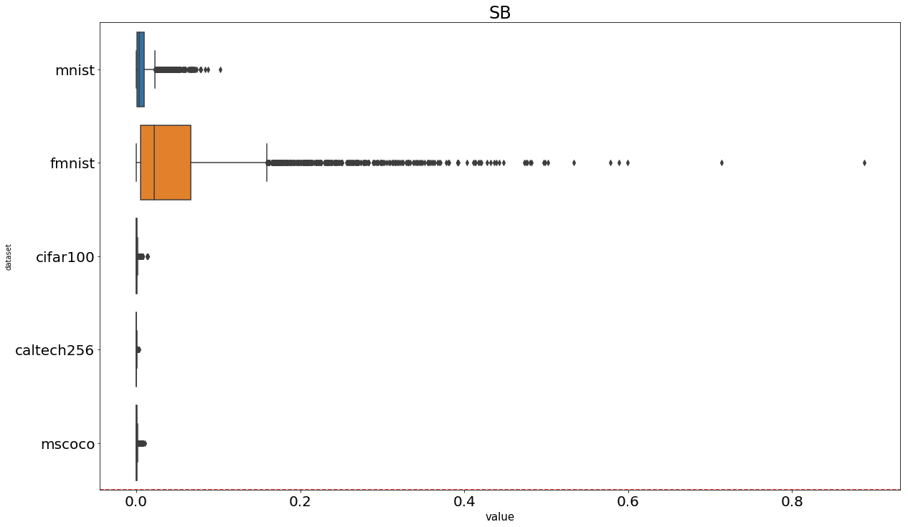
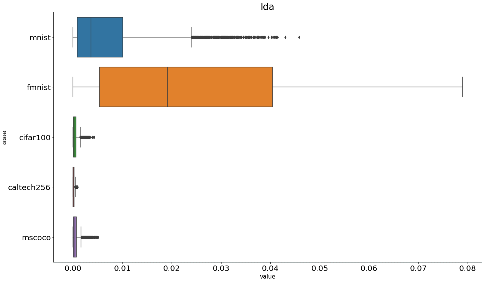

# Data-Quality-Analyzer
Fisher Linear Discriminant Analysis를 사용한 이미지 품질 지표 평가 구현체이며 데이터 내 응집성(SW), 데이터 간 응집성(SB), 응집성(LDA)으로 데이터 품질을 분석, 평가한다.

## Requirement
- Python3.6
- PIL
- pytorch
- numpy
- pandas
- scikit-learn
- argparse
- cv2

## Data
- 데이터는 다음과 같은 형식으로 저장되어 있어야한다.
  - img_folder : 이미지들을 저장하고 있는 폴더
  - data_label_info.csv : ImageFileName, Label 두 column으로 구성되어있으며 ImageFileNmae은 이미지명(ex. img001.jpg, etc), Label은 해당 이미지의 label 값으로 되어있다.

```
Project
  |--- data
  |    |--- img_folder
  |         |--- img001.jpg
  |         |--- img002.jpg
  |         |--- ...
  |    |--- data_label_info.csv
  |--- indicator.py
  |--- ...
  
```
- img_folder 안에 있는 이미지들이 Stratified Sampling(층화추출법)을 통해 랜덤으로 선택되어 지표계산에 사용된다.

## How to Run
### Arguments
- img
  - 이미지 데이터 폴더 경로
- meta
  - 이미지명과 label값을 가지고 있는 csv 파일 경로
- dataset
  - 사용하는 데이터 셋 이름, 결과 로그파일 출력을 위해 사용된다.
  - 예를들어 dataset이 caltech256이면 출력파일은 --> **caltech256**\_resize8_ratio0.100000_count300_gvn10_lda_log.txt
- process
  - 지표계산에 사용할 프로세스 수, 많을수록 계산속도가 빨라진다.
- count
  - 각 프로세스 당 랜덤 샘플링할 횟수
  - 예를들어 process는 5 count는 10일 경우 각 프로세스당 10번씩 샘플링하여 총 50번의 샘플링이 이루어진다.
- nworkers
  - 데이터 로딩에 사용할 프로세스 수, 많을수록 데이터 로딩속도가 빨라진다.
  - 0개는 메인 프로세스만 사용
- vector
  - 지표계산에 사용할 가우시안 랜덤 벡터 수
- resize
  - 데이터가 리사이즈 되었는지 명시, 결과 로그파일 출력을 위해 사용된다. 
  - 예를들어 resize가 4일경우 출력파일은 --> caltech256_**resize4**_ratio0.100000_count300_gvn10_lda_log.txt
- ratio
  - 샘플링할 비율을 정한다 0~1 사이.
  - 예를들어 데이터가 60000개, ratio가 0.1일 경우 6000개의 데이터를 랜덤 샘플링 한다.
- msample
  - 최소 샘플링 수를 정한다. 30개 이상부터 통계적인 의미가 있다고 할 수 있다.
  - 예를들어 지정된 ratio로 샘플링 할 때 클래스 내 데이터 수가 msample보다 적다면 msample개 만큼 샘플링한다.
  

### Notes
- 계산시간에 직접적인 영향을 미치는 인자들
  - image size : 클수록 느림
  - process : 높을수록 빠름
  - count : 높을수록 느림
  - vector : 높을수록 느림
  - ratio : 높을수록 느림
- msample이 30 이상이여야 결과 값이 통계적 의미를 가진다.
- 이미지 사이즈가 너무 크면 nworkers는 0으로 설정
- process 1, vector 10, count 500, ratio 0.1 일 때 각 지표의 평균 값이 대부분 수렴함

### Calculation
```
./run.sh './data/img_folder/ ./data/data_label_info.csv test 5 300 0 10 4 0.1 30
```
- 출력 로그 파일 이름은 test로 하며 5개의 프로세스, 샘플링 횟수 300번, 데이터 로딩은 메인프로세스만 사용 ,가우시안 랜덤 벡터 10개, 리사이즈는 4분의 1로 하였다고 로그파일에 명시, 샘플링 비율 10%, 최소 샘플링은 30개를 사용하여 지표계산을 한다. 총 ( 프로세스(5) x 샘플링 횟수(300) x 가우시안 랜덤벡터(10) )개의 지표 값들이 나오므로 15000개의 결과가 로그로 남는다.

```
./run.sh './data/img_folder/ ./data/data_label_info.csv caltech 4 500 5 20 8 0.5 40
```
- 출력 로그 파일 이름은 caltech로 하며 4개의 프로세스, 샘플링 횟수 500번, 데이터 로딩은 5개의 프로세스 사용 ,가우시안 랜덤 벡터 20개, 리사이즈는 8분의 1로 하였다고 로그파일에 명시, 샘플링 비율 50%, 최소 샘플링은 40개를 사용하여 지표계산을 한다. 총 ( 프로세스(4) x 샘플링 횟수(500) x 가우시안 랜덤벡터(20) )개의 지표 값들이 나오므로 80000개의 결과가 로그로 남는다.

## Evaluation
- Argumnets 설명은 'How to Run' 파트에 있음
- 지표계산 할 때 사용하였던 인자 값들을 넣어준다
```
python3 evaluate.py --dataset test --count 300 --vector 10 --resize 8 --ratio 0.1
```
실행결과



## 지표 계산 결과
### 공개 데이터 셋
| Dataset | Resize |SW(min, max) | SW(max) | LDA(max) |
| :----------: |:---------: |:---------: | :----------: | :----------: |
| MNIST | Original |( 0.497959, 2.230519 ) | 0.102267 | 0.045849 |
| FMNIST | Original |( 0.400413, 11.431007 ) | 0.887791 | 0.078948 |
| CIFAR100 | Original |( 0.350826, 6.480159 ) | 0.014300 | 0.004271 |
| CALTECH256 | 1 / 8 |( 0.315621, 7.118770 ) | 0.003722 | 0.000893 |
| MS-COCO | 1 / 8 |( 0.434393, 4.247490 ) | 0.010483 | 0.005044 |

### Boxplot
- SW

- SB
  - 

- LDA
  - FMNIST의 선형 분류성(LDA)이 다른 공개 데이터셋에 비해 높아 비교적 Classification 하기 쉽다.


